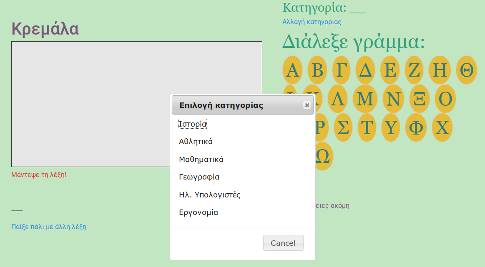
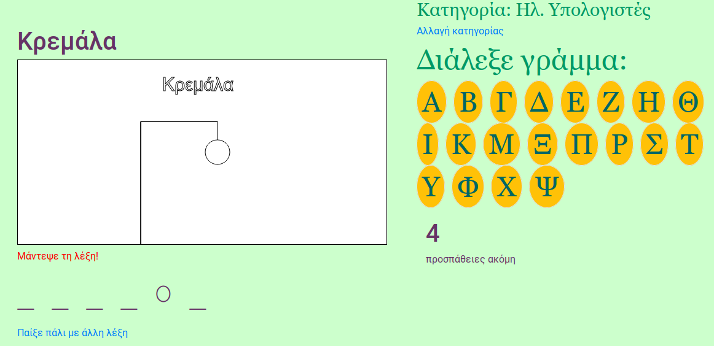
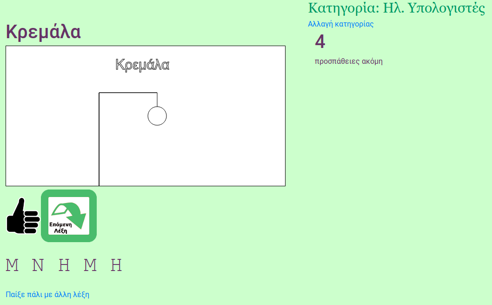
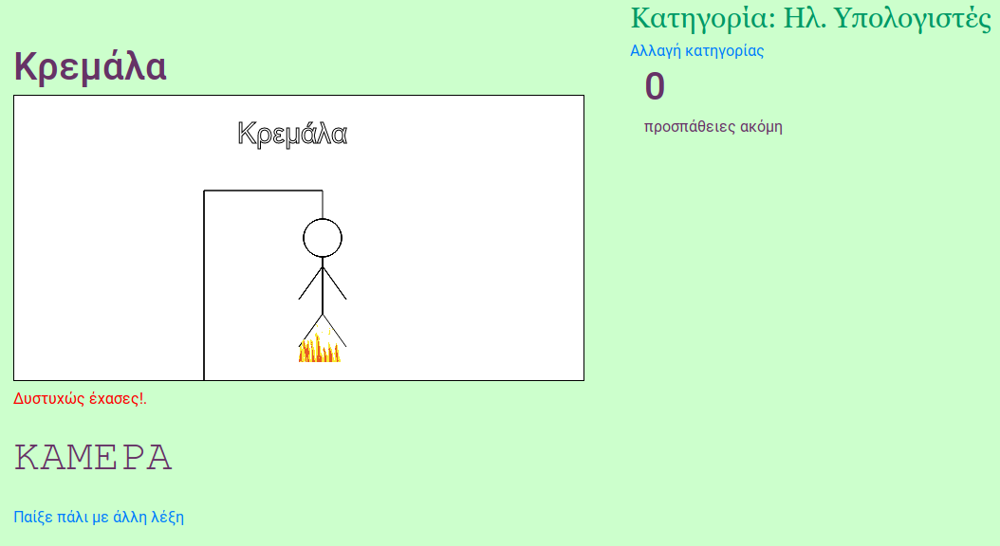

# Hangman HTML5
Ένα απλό παιχνίδι κρεμάλας με λέξεις ανά κατηγορία για μαθητές Δημοτικού αλλά και μεγαλύτερους.

Διαθέσιμες κατηγορίες:
* Ιστορία
* Αθλητικά
* Μαθηματικά
* Γεωγραφία
* Ηλεκτρονικοί Υπολογιστές
* Εργονομία

Η αρχική έκδοση του, προ fork, είναι διαθέσιμη [εδώ](https://github.com/vgabi94/Hangman-HTML5)

# Απαιτούμενα
Προτείνεται (για λόγους ευκολίας) η εγκατάσταση τους μέσω [yarn](https://yarnpkg.com/en/)

yarn install

**bower install bootstrap4 jquery jquery-ui**

# Screenshots

